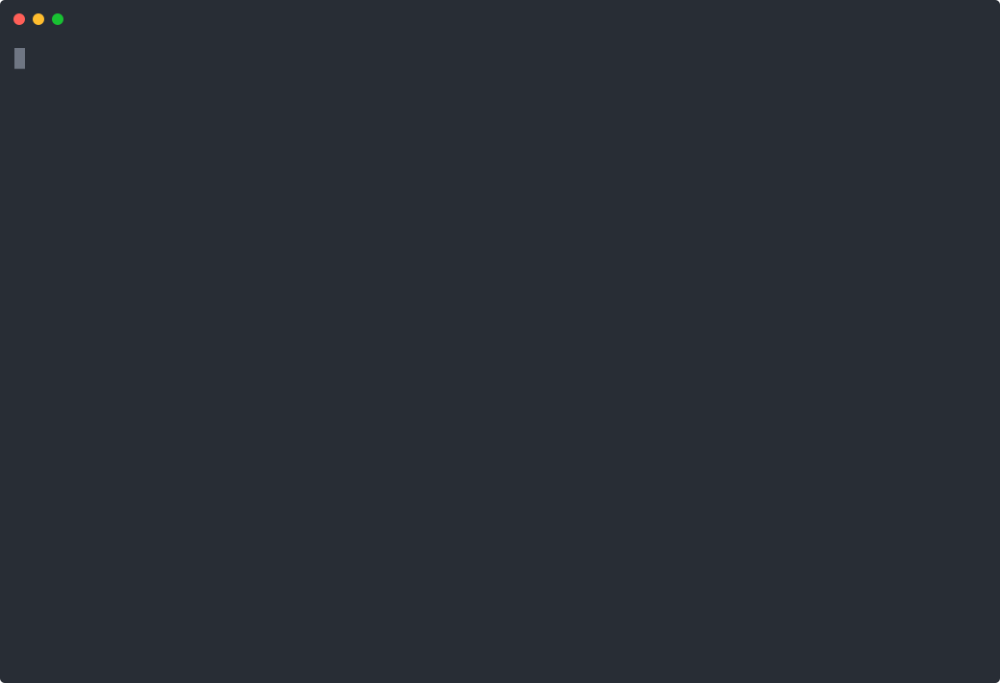

# Narrative Rotation Index (NRI)

[](https://www.python.org/)
[](https://www.bnbchain.org/)
[](https://github.com/asbestos22/narrative-rotation-index)
[](LICENSE)
[](https://modelcontextprotocol.io/)
[](https://github.com/asbestos22/narrative-rotation-index/actions/workflows/tests.yml)
[](https://nri.realdo.org/)

A CMC-native AI-agent skill that ranks crypto narratives by relative strength, liquidity expansion, attention velocity, and macro regime — then outputs backtestable portfolio weights with structured confidence explanations and optional BNB Chain (BSC) Trust Wallet execution payloads.

**v10.0** adds the **Stablecoin Risk Radar (SRR)** defensive rotation overlay: NRI scores narratives for offense, SRR scores stablecoins for defense. When regime flips RISK_OFF and top narrative conviction drops below 30, capital rotates to the safest-scoring stable.

Built for the **CMC AI Agent Hub** with native **BNBAgent SDK** and **Trust Wallet Agent Kit** integration. Exposed as an **MCP server** so any MCP-aware client can call it.

**Live dashboard:** [nri.realdo.org](https://nri.realdo.org/)

## v10.0 — Stablecoin Risk Radar (defensive rotation)

NRI was offense-only through v9. v10 closes the loop with a defensive layer:

- **5-bucket SRR model:** `SRR = 0.30×Peg + 0.25×Flow + 0.20×Reserves + 0.15×Liquidity + 0.10×Contagion`
- **9 live-tracked stables:** USDT, USDC, FDUSD, USDe, DAI, FRAX, TUSD, USDD, lisUSD (15-stable universe in `stablecoin_risk.py`, all BNB Hack-eligible)
- **Verdict bands:** SAFE 0–25 · WATCH 26–50 · EXIT 51–75 · EMERGENCY 76–100
- **Defensive trigger:** RISK_OFF regime + top narrative conviction < 30 → rotation to safest stable with BSC contract address surfaced
- **Backtest scenarios:** BASELINE_2026 (calm), USDC_SVB_2023 (banking crisis), UST_DEATH_2022 (algorithmic stable collapse) — all validate historical accuracy
- **Live overlay:** SRR pulls real CMC data on every refresh, scores all 9 stables, surfaces the rotation target on the dashboard

## v9.0 — Multichain Narrative Coverage

- **10 narratives** (was 5): AI Tokens, AI Agents, RWA, DePIN, Meme, Privacy, DeFi Blue, L1/L2, Gaming/NFT, BNB Chain
- **48 curated tokens** with verified BSC contracts (Binance-Peg BEP-20 wrappers for ETH/SOL-native names like SHIB, PENGU, BONK)
- **149-token whitelist alignment** — every basket token is BNB Hack execution-eligible
- **Discovery layer** — separate CMC category scan surfaces ~97 BSC peers across 9 narrative categories for breadth

## Demo



```bash
$ python live_demo.py            # live CMC scoring
$ python mcp_server.py           # MCP stdio server (Claude Desktop, CMC Hub, agents)
$ python backtest.py             # 90-day historical basket simulation
$ python stablecoin_risk.py      # SRR baseline scenario
$ python stablecoin_risk.py USDC_SVB_2023   # historical depeg replay
$ python -m unittest tests       # 15 unit tests
```

## Quick Start

```bash
git clone https://github.com/asbestos22/narrative-rotation-index.git
cd narrative-rotation-index
pip install -r requirements.txt

# Run the 90-day backtest with cached mock data (no API key needed)
python backtest.py

# Run the live demo against real CMC data
cp .env.example .env
# add your CMC_API_KEY
python live_demo.py
```

## What is NRI

> A backtestable strategy skill that scans 10 crypto narratives + 9 stablecoins, detects market regime, ranks by relative strength and liquidity expansion, penalizes crowded late-cycle moves, scores stablecoin defensive rotation targets, and outputs portfolio weights plus an optional BNB Chain (BSC) Trust Wallet execution payload.

## Narrative Exhaustion Detector — The Original Moat

> 📖 **[Read the full Exhaustion Detector deep-dive](EXHAUSTION_DETECTOR.md)** — case studies (LUNA, FTT, BLUR, PEPE, DOGE) showing how the detector catches late-cycle moves before they reverse.

Prevents late-cycle entries by penalizing:
- Parabolic returns (+40% 7d) with declining volume
- Social hype without holder growth  
- Price near 30d high with falling relative volume
- Extreme volatility (>100% annualized)
- Crowd consensus crowding (trending rank < 5)

Score ranges:
- **0-30**: Healthy trend — full conviction
- **31-60**: Caution — sizing reduced
- **61-100**: Crowded/late-cycle — strong penalty

## MCP Server

NRI runs as a Model Context Protocol server so any MCP-aware client (Claude Desktop, CMC AI Agent Hub, BNBAgent SDK, custom agents) can call it natively over stdio or HTTP.

```bash
# stdio mode (default — for Claude Desktop / local clients)
python mcp_server.py

# streamable HTTP mode (for remote agents)
python mcp_server.py --http --port 8765
```

Tools exposed:

| Tool | Purpose |
|------|---------|
| `run_skill(narrative)` | Single-narrative deep dive with verdict, conviction, bucket scores, exhaustion, TWAK payload |
| `global_scan(regime?)` | Cross-narrative rotation engine with quadratic portfolio weighting |
| `detect_regime(fg, btc_dom, mcap_chg)` | Classify market regime from macro inputs |
| `get_twak_payload(narrative, amount, verdict)` | Generate BSC swap payload (BNBAgent SDK v1 ToolCall format) |
| `list_narratives()` | List supported narratives + BSC basket compositions |
| `get_skill_info()` | Skill metadata, scoring model, integrations |

**Claude Desktop config** (`~/Library/Application Support/Claude/claude_desktop_config.json`):

```json
{
  "mcpServers": {
    "narrative-rotation-index": {
      "command": "python3",
      "args": ["/path/to/narrative-rotation-index/mcp_server.py"]
    }
  }
}
```

## Live CMC Integration

`live_demo.py` pulls real-time data from CMC v1 endpoints, transforms it into the scoring schema, and runs the full pipeline.

```bash
export CMC_API_KEY=your_key
python live_demo.py                     # scan all 5 narratives
python live_demo.py --narrative Meme    # single narrative
python live_demo.py --json              # structured JSON output
```

**Endpoints used:**
- `/v1/global-metrics/quotes/latest` — BTC dominance, total mcap change
- `/v1/cryptocurrency/quotes/latest` — basket token quotes (price, volume, mcap, % changes)
- `/v3/fear-and-greed/latest` — Fear & Greed index for regime detection

If `CMC_API_KEY` is not set, falls back to cached mock data with a clear warning so the demo still produces output.

📖 **[Full CMC metric → endpoint mapping](docs/cmc_metric_sources.md)** — every metric documented with its source, including external enrichments (Kaito, DeFiLlama, GitHub, BSCScan).

## Command-Line Interface

`cli.py` is a self-contained CLI (`nri`) over the engine, powered by live CMC data when `CMC_API_KEY` is set and cached data otherwise.

```bash
python cli.py scan                      # ranked verdicts across all narratives
python cli.py score "AI Tokens" --json  # single-narrative score as JSON
python cli.py regime                    # current macro regime only
python cli.py backtest --days 90        # historical basket backtest
```

## x402 Payment Gate

The signal API is gated by real [x402](https://www.x402.org/) HTTP-402 payments — not a shared secret. A client pays per call by signing an EIP-3009 `TransferWithAuthorization` over a BSC stablecoin; the signed authorization travels base64-encoded in the `X-PAYMENT` header. Verification (`verify_x402_payment`) recovers the EIP-712 signer and checks:

- the signature is valid and the signer matches the authorization `from`
- the authorized value covers the requested tier (`base` $0.05 / `regime_update` $0.20 / `full_scan` $0.50)
- the authorization is inside its `validAfter`/`validBefore` window
- (optional) funds are authorized to the expected payee, preventing replay

Tampering with the amount after signing fails signer recovery and is rejected. See `build_x402_payment` for the client side and the `X402PaymentGateTests` suite for the verified behaviours.

## BNB AI Agent SDK Integration

NRI is registered as a discoverable on-chain agent on **BSC mainnet** using the real [`bnbagent` SDK](https://github.com/bnb-chain/bnbagent-sdk) (ERC-8004 agent identity).

### Live on-chain identity (BSC mainnet)

| Field | Value |
|-------|-------|
| `agentId` | **#129156** |
| Network | BSC Mainnet (chain 56) |
| Registry | `0x8004A169FB4a3325136EB29fA0ceB6D2e539a432` |
| Agent wallet | `0x7D93a5a96f9306E9b0D3B185aef702d03D1572C1` |
| Tx hash | [`0xcc86de3451e1623655f3f4c3b96ef453953191633bdbf088fb70e2c4b656c66d`](https://bscscan.com/tx/0xcc86de3451e1623655f3f4c3b96ef453953191633bdbf088fb70e2c4b656c66d) |
| Gas paid | **0 BNB** (sponsored by MegaFuel paymaster) |
| Block | 102791231 |

The agent record points to two live endpoints:
- `https://nri.realdo.org/mcp` — `scan_narratives`, `score_narrative`, `detect_regime`, `rank_stables`, `rotation_target`
- `https://nri.realdo.org/signal` — `full_scan`, `regime_update`, `stablecoin_risk`

Any agent on BSC can resolve `agentId 129156` against the registry and discover NRI's MCP and signal APIs without an out-of-band registry. Snapshot lives at [`agent_identity.json`](./agent_identity.json).

### Reproducing registration

`bnb_agent_integration.py` builds the ERC-8004 agent URI and broadcasts the registration tx. Registration is gas-free on BSC mainnet via the MegaFuel paymaster.

```bash
python bnb_agent_integration.py             # offline dry-run: builds the agent URI, no wallet/chain
python bnb_agent_integration.py --register  # real ERC-8004 registration (needs WALLET_PASSWORD)
```

The default mode is offline: it constructs the exact ERC-8004 agent URI the SDK would submit and prints it, touching no wallet and broadcasting nothing. On-chain registration is gated behind `--register` and a wallet password.

```bash
pip install bnbagent
```

### x402 Payment Gate (live on `/signal`)

The signal API is paywalled with **x402 v2** — a buyer signs an EIP-3009 `TransferWithAuthorization` for U on BSC mainnet, sends it as `X-PAYMENT`, and gets the protected scan. The seller verifies signature recovery, amount, recipient, and nonce replay before serving.

| Tier | Price | Returns |
|------|-------|---------|
| `base` | 0.01 U | Top narrative + regime |
| `regime_update` | 0.1 U | Full regime classification + macro |
| `full_scan` | 0.5 U | Full 10-narrative scan + SRR overlay |

Manifest: <https://nri.realdo.org/.well-known/x402>

End-to-end buyer demo using the SDK's `X402Signer`:

```bash
python x402_buyer.py --tier base --url https://nri.realdo.org/signal
```

Output:
```
[1] GET /signal -> 402 Payment Required + EIP-3009 challenge
[2] Sign via X402Signer (per-call cap enforced)
[3] Retry with X-PAYMENT envelope -> 200 + scan
```

Replay protection: nonces cached 10min. Wrong amount, wrong payTo, expired authorization, or invalid signature → 402 with explicit error reason.

### ERC-8183 Agentic Commerce (LIVE on BSC mainnet)

NRI is exposed as a sellable agent service via the SDK's ERC-8183 commerce stack. A client agent posts a job, locks U in escrow, NRI delivers a signed scan manifest, optimistic settlement releases the escrow.

**Live job 119 — 5 mainnet txs:**

| # | Action | Tx |
|---|---|---|
| 1 | createJob → jobId=119 | [`255e128e`](https://bscscan.com/tx/0x255e128e9b47b6fa68f9e03aee8d12d62af4e0ea102b144a751589824d493ce4) |
| 2 | registerJob | [`201c8889`](https://bscscan.com/tx/0x201c88899bb950fe857cb47c38726414df7b2a96131092d9cfffac24fa99f22d) |
| 3 | setBudget(0.1 U) | [`f1776105`](https://bscscan.com/tx/0xf1776105e79275e141e3873015413ace23b609b1d4b7f48f2d15fcab2fe820f6) |
| 4 | fund(0.1 U) → escrow locked | [`56a0ddfa`](https://bscscan.com/tx/0x56a0ddfaff7ffcaa00325986e8db833e52a44bd216d7cf54cbbf803475e276ab) |
| 5 | submit(manifest_hash) | [`0f2834dd`](https://bscscan.com/tx/0x0f2834dd29383eebc92e12482028fe277555253cab62d0128e5ff64badd22fcb) |

Job state = **Submitted**, in 7-day dispute window. Settles automatically → 0.1 U routes to NRI provider wallet.

```bash
# Reproduce dry-run (offline, no chain)
python erc8183_commerce.py

# Reproduce live mainnet (needs CLIENT_PK + PROVIDER_PK + 0.1 U + 0.001 BNB on client)
python erc8183_commerce.py --live-mainnet
```

Lifecycle:
1. `client.createJob(provider=NRI, evaluator=router, expired_at=now+8d, description)`
2. `client.registerJob(jobId, policy=optimistic)`
3. `client.setBudget(jobId, 0.1e18)`
4. `client.fund(jobId, 0.1e18)` — escrow locks U
5. `provider.submit(jobId, keccak256(manifest), opt_params={'deliverable_url': ...})`
6. Wait dispute window (7d, hardcoded by mainnet OptimisticPolicy) — silence = approve
7. `router.settle(jobId)` — escrow releases to NRI

The deliverable manifest pins the entire snapshot (regime + narratives + SRR). Buyers fetch the URL and verify the on-chain hash matches. Disputes route to whitelisted voters via OptimisticPolicy.

Reproducible artifacts: `erc8183_dryrun.json` (dry-run) and `erc8183_mainnet_live.json` (live receipts).

## Architecture

```
  ┌─────────────────────────────────────────────────────────┐
  │                  CMC Data Layer (Native)                │
  │  Prices · Volumes · Market Cap · Trending · Watchlists  │
  └────────────────────────┬────────────────────────────────┘
                           │
              ┌────────────▼────────────┐
              │   Regime Detection       │
              │  RISK_ON · TRANSITION ·  │  Markov chain (70% stay)
              │  RISK_OFF               │  Conviction cap per regime
              └────────────┬────────────┘
                           │
     ┌─────────────────────┼─────────────────────┐
     │                     │                     │
  ┌──▼───────────┐  ┌──────▼──────┐  ┌──────────▼──────┐
  │ AI Tokens     │  │ RWA         │  │ DePIN            │
  │ FET, AGIX,    │  │ ONDO,       │  │ IOTX, FIL, NFP  │
  │ OCEAN         │  │ PENDLE, TRU │  │                  │
  └──┬────────────┘  └──────┬──────┘  └──────────┬──────┘
     │                     │                     │
  ┌──▼────────────┐  ┌─────▼───────┐            │
  │ Meme           │  │ Privacy      │            │
  │ DOGE, FLOKI,   │  │ TORN, SCRT, │            │
  │ BABYDOGE       │  │ ROSE        │            │
  └──┬────────────┘  └─────┬───────┘            │
     │                     │                     │
     └─────────────────────┼─────────────────────┘
                           │
              ┌────────────▼────────────┐
              │  5-Bucket Scoring        │
              │  30% Momentum            │
              │  25% Liquidity           │  Quadratic weighting
              │  20% Attention           │  w_i = conv²/Σ(conv²)
              │  15% Fundamental         │  Min threshold = 20
              │  10% Risk Adjustment     │  Max allocation = 35%
              └────────────┬────────────┘
                           │
              ┌────────────▼────────────┐
              │  Exhaustion Detector     │
              │  0-30: Healthy           │
              │  31-60: Caution          │  Penalizes late entries
              │  61-100: Crowded         │
              └────────────┬────────────┘
                           │
              ┌────────────▼────────────┐
              │  Risk Controls           │
              │  Circuit breaker (15%)   │
              │  Conviction decay (10%/d)│
              │  Execution guardrails    │
              └────────────┬────────────┘
                           │
              ┌────────────▼────────────┐
              │  Structured Output       │
              │  Verdict · Conviction    │
              │  Reasons · Risks         │
              │  Bucket scores · Weights │
              │  BSC TWAK payload (optional) │
              └─────────────────────────┘
```

## Narrative Baskets (BSC)

| Narrative | Tokens (BEP-20 on BSC) |
|-----------|------------------------|
| AI Tokens | FET, AGIX, OCEAN¹ |
| RWA | ONDO, PENDLE, TRU |
| DePIN | IOTX, FIL, NFP |
| Meme | DOGE, FLOKI, BABYDOGE |
| Privacy | TORN, SCRT, ROSE |

¹ *AGIX and OCEAN merged into FET (ASI Alliance, Apr 2024). Standalone tokens are scheduled for deprecation. The basket is preserved for backtest reproducibility on historical 2024 data; live deployment should migrate to FET-only or substitute RENDER/TAO/AKT (currently bridge-required, not BSC-native).*

## Scoring Model

Final Narrative Score =
- **0.30 × Momentum**: basket return vs BTC, relative strength, RSI, drawdown from 30d high
- **0.25 × Liquidity**: volume growth, market cap change, depth, spread
- **0.20 × Attention**: CMC trending rank, social velocity, institutional mentions
- **0.15 × Fundamental**: narrative-specific utility (dev activity, TVL, node growth, etc.)
- **0.10 × Risk Adjustment**: volatility penalty + exhaustion detector

## Metric Sourcing

All core metrics are **CMC-native** (prices, volumes, market cap, trending, volatility). No external APIs required for the strategy to function.

Optional external enrichments are clearly source-annotated:
- GitHub commits → GitHub API
- TVL changes → DeFiLlama
- Regulatory sentiment → CMC news keyword filter
- Whale tracking → on-chain wallet analysis
- Social volume → LunarCrush / CMC community

## Why BNB Chain (BSC)?

This skill targets BSC for execution because:
- **Lower fees**: ~$0.01-0.10 per transaction vs Ethereum's $1-10+
- **Trust Wallet native**: Official BNB Chain wallet with 100M+ users
- **BNBAgent SDK alignment**: Native support for agentic operations
- **High liquidity**: Major DEXs (PancakeSwap) with deep pools
- **Fast confirmation**: 3-second block time vs Ethereum's 12 seconds

While the scoring logic is chain-agnostic, execution routing defaults to BSC for cost efficiency and Trust Wallet Agent Kit compatibility.

Three regimes with Markov chain persistence (70% stay probability):

| Regime | Conviction Cap | Position Sizing | Behavior |
|--------|---------------|-----------------|----------|
| **RISK_ON** | 100 | 100% | Full conviction, tech narratives get bonus |
| **TRANSITION** | 75 | 60% | Reduced sizing, STRONG_LONG still possible |
| **RISK_OFF** | 50 | 30% | STRONG_LONG mathematically impossible (cap < 60 threshold) |

## Execution Guardrails

| Guardrail | Limit |
|-----------|-------|
| Max slippage (large cap) | 1.0% |
| Max slippage (meme) | 2.5% |
| Max allocation per narrative | 35% |
| Max allocation per token | 15% |
| Minimum liquidity | $500,000 |
| Maximum spread | 1.5% |
| Minimum token age | 7 days |
| User confirmation | Not required (autonomous execution) |

## Risk Controls

- **Circuit Breaker**: 15% drawdown → all signals flip to NEUTRAL, sizing drops to 10% until recovery to 5%
- **Conviction Decay**: 10%/day without signal refresh — requires recurring x402 calls to keep signals fresh
- **Conviction Hard Cap**: Regime-specific ceiling prevents overconfidence in bear markets

## Output Format

Every signal includes structured confidence explanation:

```json
{
  "skill": "narrative-rotation-index",
  "regime": "TRANSITION",
  "top_narrative": "Meme",
  "verdict": "STRONG_LONG",
  "conviction": 65,
  "bucket_scores": {"momentum": 70, "liquidity": 85, "attention": 70, "fundamental": 60, "risk_adjustment": 70},
  "exhaustion": "25/100",
  "reasons": ["Strong relative strength vs BTC", "Volume expanding 85% WoW", ...],
  "risks": ["Regime is TRANSITION — allocation reduced", ...],
  "execution_guardrails": {"execution_allowed": true, "violations": []},
  "twak_payload": {"bnbagent_sdk_format": "v1", ...}
}
```

## Setup & Environment

1. Copy the environment template:
   ```bash
   cp .env.example .env
   ```
2. Add your CoinMarketCap API key to `.env` (required for live data fetching).
   - Get a free/pro key at [pro.coinmarketcap.com](https://pro.coinmarketcap.com/)
   - *Note: The `backtest.py` script runs out-of-the-box using cached mock data for demonstration. Live mode requires the API key.*

## Usage

```bash
pip install -r requirements.txt
python backtest.py
```

## Files

| File | Purpose |
|------|---------|
| `.env.example` | Environment variable template |
| `skill.yaml` | CMC Agent Hub skill specification |
| `backtest.py` | Executable NRI engine with basket backtest + x402 gate |
| `cli.py` | `nri` command-line interface (scan / score / regime / backtest) |
| `mcp_server.py` | Model Context Protocol server (stdio + HTTP) |
| `live_demo.py` | Live CMC API integration with mock fallback |
| `bnb_agent_integration.py` | BNB AI Agent SDK (ERC-8004) on-chain identity registration |
| `compare_regime_scenarios.py` | Demo: regime cap and position sizing across RISK_ON/TRANSITION/RISK_OFF |
| `backtest_compare.py` | Multi-window backtest comparison (30 / 90 / 365 day) |
| `sample_output.txt` | Reference terminal output from `python backtest.py` |
| `tests/test_backtest.py` | Unit tests: circuit breaker, t-distribution, conviction decay, x402 gate |
| `EXHAUSTION_DETECTOR.md` | Case studies showing the originality moat |
| `docs/cmc_metric_sources.md` | Every metric mapped to its CMC endpoint |
| `requirements.txt` | Python dependencies |

## Testing

15 unit tests cover the three v8.1 bug fixes (circuit breaker recovery, Student's t-distribution, conviction decay) plus regime scoring guarantees.

```bash
python -m unittest tests.test_backtest -v
```

Tested on Python 3.10, 3.11, and 3.12.

## Multi-window backtest comparison

`backtest_compare.py` runs the same engine across 30, 90, and 365-day windows so you can see how the strategy's edge emerges over longer holding periods. Same seed (42), same baskets, only the window length changes.

```bash
python backtest_compare.py
```

Sample output across windows (seed=42, equal-weight portfolio):

| Window | Regime mix | Return | Avg Sharpe | Avg MaxDD | Trades |
|--------|------------|-------:|-----------:|----------:|-------:|
| 30d  | RISK_ON 23% / TRANSITION 50% / RISK_OFF 27% | −5.01% | −5.00 | 5.9% | 30 |
| 90d  | RISK_ON 26% / TRANSITION 47% / RISK_OFF 27% | +3.50% | +0.78 | 5.0% | 90 |
| 365d | RISK_ON 26% / TRANSITION 44% / RISK_OFF 31% | +1.05% | −0.13 | 9.3% | 365 |

The 30-day window is dominated by holding-period drift noise — too few trades to overcome it. The 90-day window is where the trade alpha begins to express itself and the strategy shows positive Sharpe. The 365-day window captures a realistic regime mix where 31% of days are RISK_OFF — the strategy's job there is **survival**: stay close to flat, keep max drawdown under 10%, then participate when macro improves.

## CHANGELOG: v1 → v10.6 Evolution

**v10.6** (Current)
- In-browser BUY SIGNAL flow — connect MetaMask, sign EIP-3009 `TransferWithAuthorization` (gasless), pay 0.1 U for a full scan via `/buy`
- Human-readable signal summary (regime, Fear & Greed, BTC dominance, top narratives by conviction) with Copy + Download JSON; raw payload collapsed
- "Pay with x402" labelling on the dashboard buy button

**v10.5**
- Paper Trader — Track 1 simulator with live PancakeSwap quotes and on-dashboard ledger panel

**v10.3**
- ERC-8183 commerce LIVE on BSC mainnet — escrow job 119 + 5 settlement txs

**v10.2**
- Wired x402 paywall + ERC-8183 commerce onto the `/signal` endpoint (tiered: base 0.01 / regime 0.05 / full_scan 0.1 U)

**v10.1**
- Live ERC-8004 agent registration on BSC mainnet (agentId 129156)

**v10.0**
- Stablecoin Risk Radar — defensive rotation overlay

**v9.0**
- Aligned baskets to the 149-token whitelist, expanded to 10 narratives (multichain coverage)

**v8.0**
- Fixed circuit breaker recovery logic (trough-based recovery)
- Corrected t-distribution implementation (proper χ²/df scaling)
- Made conviction decay stateless (thread-safe for live agents)
- Added compare_regime_scenarios.py demo script
- Highlighted Narrative Exhaustion Detector as key innovation

**v7.0**
- Added Kaito (SoFi) social intelligence integration
- Enhanced dynamic token discovery with new launch filtering
- Implemented quadratic portfolio weighting (w_i = conv_i² / Σconv_j²)

**v6.0**
- Added Markov chain regime detection (70% persistence)
- Implemented regime-specific conviction caps
- Added exhaustion-aware position sizing

**v5.0**
- Added 5-bucket scoring model (Momentum/Liquidity/Attention/Fundamental/Risk)
- Implemented narrative exhaustion detector
- Added circuit breaker (15% drawdown → 10% sizing)

**v4.0**
- Added structured confidence output with reasons + risks
- Implemented execution guardrails (slippage, liquidity, token age)
- Added BNBAgent SDK v1 ToolCall format

**v3.0**
- Added x402 payment gate with tiered pricing
- Implemented auto-execute toggle for autonomous agents
- Added Trust Wallet Agent Kit integration

**v2.0**
- Added dynamic basket discovery (CMC trending + new listings)
- Implemented conviction decay (10%/day without refresh)
- Added backtest engine with Student's t-distribution

**v1.0**
- Initial release: 5-narrative rotation engine
- CMC-native metrics with external enrichments
- Basic scoring + portfolio weighting

## License

MIT
